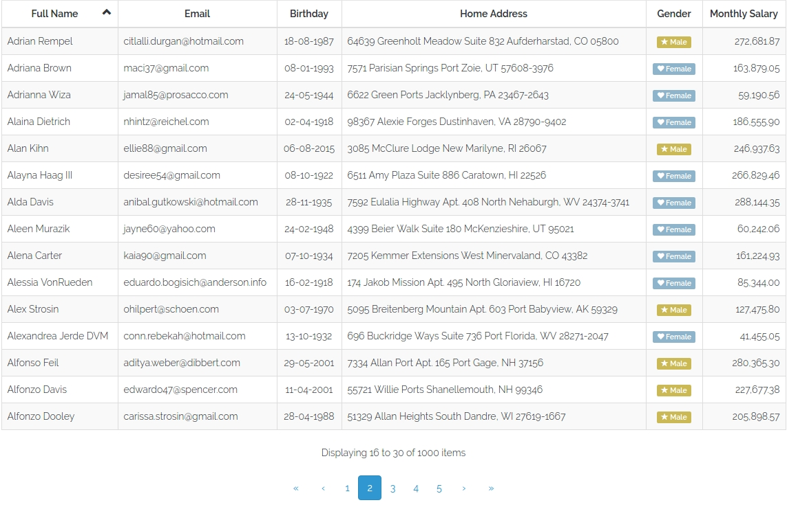

# vuetable-2-laravel-example
Sample project for [vuetable-2](https://github.com/ratiw/vuetable-2) with Laravel

# How to use it on your local computer
- Clone the project
- Make settings for your homestead (in Homestead.yaml). Local URL - vuetable.example.test, database - vuetable_example.
- Go into local site application directory
- Run `composer install`
- Run `yarn install` or `npm install`
- Run `yarn run dev` or `npm run dev`
- Run `php artisan migrate`
- Run `php artisan db:seed`
- Open http://vuetable.example.test in you browser
